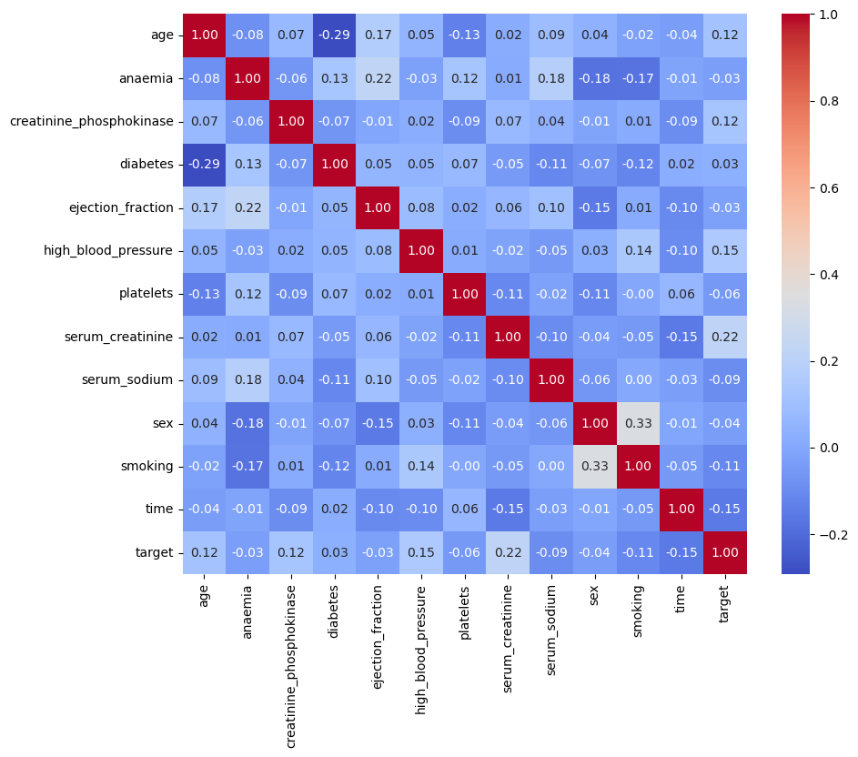
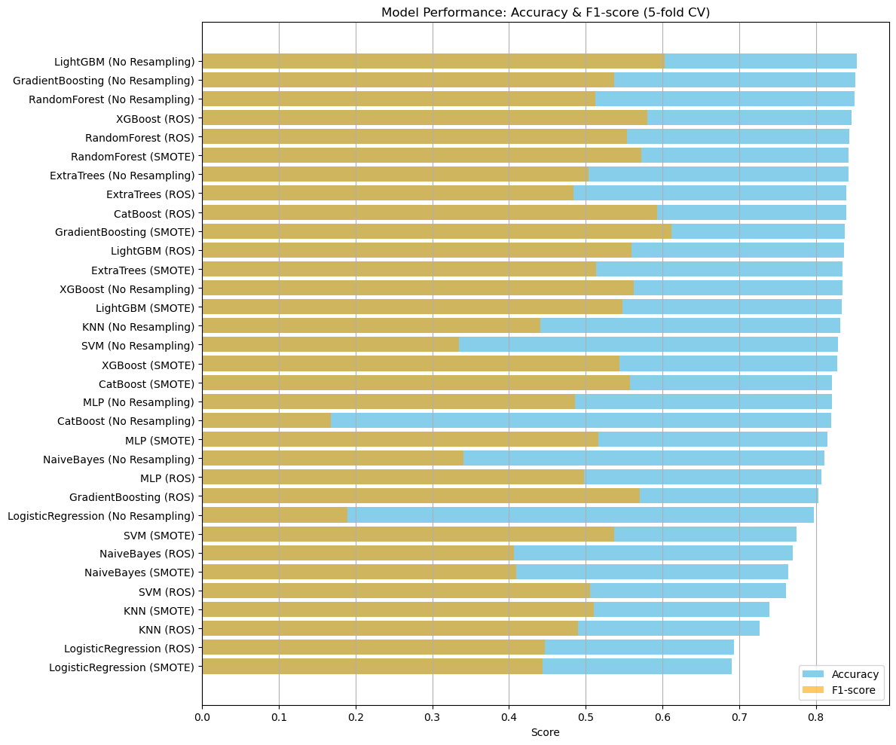
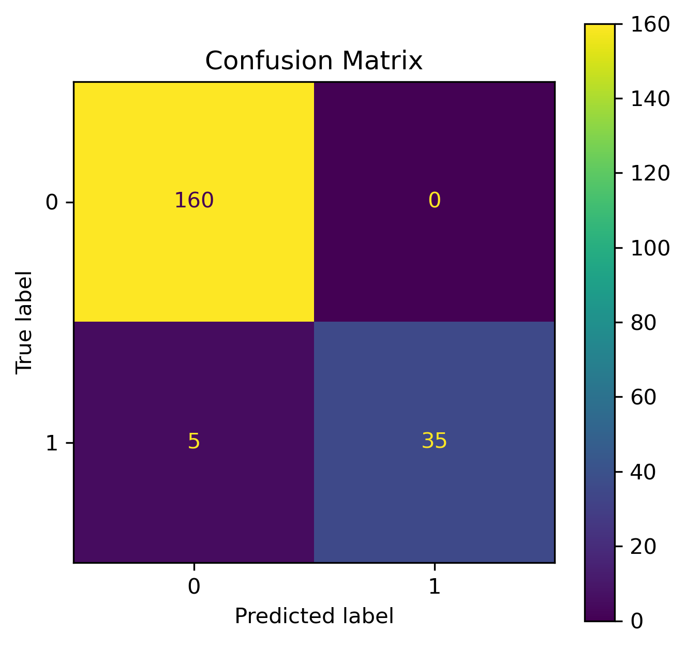

# Heart Failure Prediction

📝 日本語版はこのドキュメントの後半にあります。

> This repository contains the solution for the [Signate Competition #1394](https://signate.jp/competitions/1394): **【第57回_Beginner限定コンペ】採血データを使った心不全予測**.

The competition aims to build a predictive model using patient data to determine patients with heart failure (target = 1). The dataset includes clinical metrics and demographic information and is characterized by class imbalance.

---

## 📂 Project Structure

- `main.ipynb` — main analysis and modeling notebook
- `final_model.pkl` — saved trained model for inference
- `requirements.txt` — list of dependencies

---

## 🧠 Problem Overview

Given a dataset of 1000 patients with clinical features, predict which ones will experience heart failure (binary classification). The dataset is imbalanced: only ~22% are positive cases.

---

## 🧪 Dataset Overview

- **Rows:** 1000 samples (train), 1000 (test)
- **Features:** Clinical and lifestyle features such as:
  - `age`, `serum_creatinine`, `platelets`, `ejection_fraction`, etc.



---

## 🧼 Data Preprocessing

- All numerical features were scaled using `StandardScaler`
- Custom features were engineered via a `CustomFeatureAdder`:
  - `creatinine_to_platelets` — ratio feature
  - `binarized_time` — derived binary feature from `time`
- No label encoding or one-hot encoding was necessary due to selected features being all numerical after filtering

---

## 🔍 Model Comparison and Top Model Selection

Multiple models were tested using Stratified K-Fold cross-validation. Accuracy and F1-score were used for evaluation.

**Top performing models:**
- `LightGBM (No Resampling)`
- `GradientBoosting (No Resampling)`
- `RandomForest (No Resampling)`
- `XGBoost (ROS)`

These models were selected for use in the final ensemble.



---

## ✂️ Feature Selection

Feature selection was done using `SelectFromModel` with `LGBMClassifier`:

**Final selected features:**
- `age`
- `creatinine_phosphokinase`
- `platelets`
- `serum_creatinine`
- `serum_sodium`
- `time`
- `creatinine_to_platelets`


---

## ⚙️ Final Model: StackingClassifier

A `StackingClassifier` ensemble was trained on the selected features using:

### Base Models:
- `LGBMClassifier`
- `XGBClassifier`
- `CatBoostClassifier`
- `GradientBoostingClassifier`

### Meta-Model:
- `LogisticRegression(C=10)` with `passthrough=True`
- Tuned using `GridSearchCV` on final estimator

---

## 🎯 Final Performance (on holdout test set)

- **Accuracy:** 0.97
- **F1-score (target = 1):** 0.93
- **Recall (target = 1):** 0.88



## 🚀 How to Use

1. Install dependencies:
```bash
pip install -r requirements.txt
```

2. Run predictions:
```python
import joblib, pandas as pd

model = joblib.load('final_model.pkl')
test_df = pd.read_csv('test.csv')

fe = CustomFeatureAdder()
X_test = fe.transform(test_df)[model.feature_names_in_]
y_pred = model.predict(X_test)
```

---

## 📚 Acknowledgements
- data set source: https://signate.jp/competitions/1394
- LightGBM, XGBoost, CatBoost
- Scikit-learn

---

# 心不全予測

📝 本リポジトリは [Signate コンペティション #1394](https://signate.jp/competitions/1394)：**【第57回_Beginner限定コンペ】採血データを使った心不全予測** に対する解答です。

このコンペティションでは、患者の臨床データを用いて心不全（target = 1）を予測するモデルの構築を目指します。データセットには臨床指標や人口統計情報が含まれており、クラス不均衡が特徴です。

---

## 📂 プロジェクト構成

- `main.ipynb` — 分析とモデリングを行うメインノートブック
- `final_model.pkl` — 推論用に保存された学習済みモデル
- `requirements.txt` — 依存ライブラリのリスト

---

## 🧠 課題の概要

1000人の患者の臨床特徴量を用いて、心不全を経験するかどうか（二値分類）を予測します。データセットは不均衡であり、陽性ケースは約22%です。

---

## 🧪 データセットの概要

- **行数:** 1000件（訓練用）、1000件（テスト用）
- **特徴量:** 以下のような臨床および生活習慣に関する特徴量：
  - `age`, `serum_creatinine`, `platelets`, `ejection_fraction` など


---

## 🧼 データ前処理

- 数値特徴量はすべて `StandardScaler` を用いてスケーリングしました
- `CustomFeatureAdder` を使用して以下のカスタム特徴量を作成しました：
  - `creatinine_to_platelets` — 比率特徴量
  - `binarized_time` — `time` から導出されたバイナリ特徴量
- 最終的に選択された特徴量はすべて数値型であり、エンコーディングは不要でした

---

## 🔍 モデル比較とトップモデルの選定

Stratified K-Fold クロスバリデーションを使用して複数のモデルをテストしました。Accuracy と F1-score を評価指標としています。

**上位モデル：**
- `LightGBM (No Resampling)`
- `GradientBoosting (No Resampling)`
- `RandomForest (No Resampling)`
- `XGBoost (ROS)`

これらのモデルは最終アンサンブルに使用されました。


---

## ✂️ 特徴量選択

`LGBMClassifier` を用いた `SelectFromModel` によって特徴量の選択を行いました：

**最終的に選択された特徴量：**
- `age`
- `creatinine_phosphokinase`
- `platelets`
- `serum_creatinine`
- `serum_sodium`
- `time`
- `creatinine_to_platelets`


---

## ⚙️ 最終モデル: StackingClassifier

選択された特徴量を用いて `StackingClassifier` アンサンブルを構築しました：

### ベースモデル：
- `LGBMClassifier`
- `XGBClassifier`
- `CatBoostClassifier`
- `GradientBoostingClassifier`

### メタモデル：
- `LogisticRegression(C=10)`（`passthrough=True`）
- `GridSearchCV` によって最適化

---

## 🎯 最終パフォーマンス（検証用テストセット）

- **Accuracy:** 0.97
- **F1-score（target = 1）:** 0.93
- **Recall（target = 1）:** 0.88


---

## 🚀 使用方法

1. 依存ライブラリのインストール：
```bash
pip install -r requirements.txt
```

2. 予測の実行：
```python
import joblib, pandas as pd

model = joblib.load('final_model.pkl')
test_df = pd.read_csv('test.csv')

fe = CustomFeatureAdder()
X_test = fe.transform(test_df)[model.feature_names_in_]
y_pred = model.predict(X_test)
```

---

## 📚 謝辞
- データセット提供元：https://signate.jp/competitions/1394
- LightGBM, XGBoost, CatBoost
- Scikit-learn

