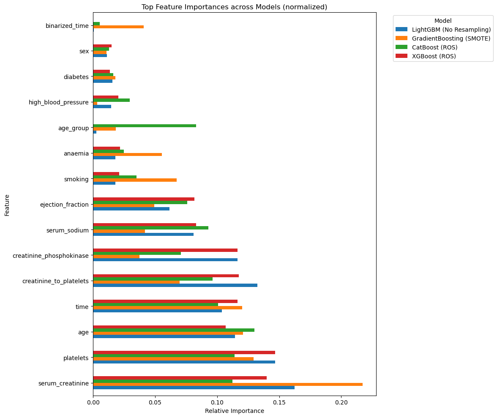

# Heart Failure Prediction

> This repository contains the solution for the [Signate Competition #1394](https://signate.jp/competitions/1394): **【第57回_Beginner限定コンペ】採血データを使った心不全予測**.

The competition aims to build a predictive model using patient data to determine patients with heart failure (target = 1). The dataset includes clinical metrics and demographic information and is characterized by class imbalance.

---

## 📂 Project Structure

- `main.ipynb` — main analysis and modeling notebook
- `final_model.pkl` — saved trained model for inference
- `requirements.txt` — list of dependencies

---

## 🧠 Problem Overview

Given a dataset of 1000 patients with clinical features, predict which ones will experience heart failure (binary classification). The dataset is imbalanced: only ~22% are positive cases.

---

## 🧪 Dataset Overview

- **Rows:** 1000 samples (train), 1000 (test)
- **Features:** Clinical and lifestyle features such as:
  - `age`, `serum_creatinine`, `platelets`, `ejection_fraction`, etc.


---

## 🧼 Data Preprocessing

- All numerical features were scaled using `StandardScaler`
- Custom features were engineered via a `CustomFeatureAdder`:
  - `creatinine_to_platelets` — ratio feature
  - `binarized_time` — derived binary feature from `time`
- No label encoding or one-hot encoding was necessary due to selected features being all numerical after filtering

---

## 🔍 Model Comparison and Top Model Selection

Multiple models were tested using Stratified K-Fold cross-validation. Accuracy and F1-score were used for evaluation.

**Top performing models:**
- `LightGBM (No Resampling)`
- `GradientBoosting (No Resampling)`
- `RandomForest (No Resampling)`
- `XGBoost (ROS)`

These models were selected for use in the final ensemble.


---

## ✂️ Feature Selection

Feature selection was done using `SelectFromModel` with `LGBMClassifier`:

**Final selected features:**
- `age`
- `creatinine_phosphokinase`
- `platelets`
- `serum_creatinine`
- `serum_sodium`
- `time`
- `creatinine_to_platelets`



---

## ⚙️ Final Model: StackingClassifier

A `StackingClassifier` ensemble was trained on the selected features using:

### Base Models:
- `LGBMClassifier`
- `XGBClassifier`
- `CatBoostClassifier`
- `GradientBoostingClassifier`

### Meta-Model:
- `LogisticRegression(C=10)` with `passthrough=True`
- Tuned using `GridSearchCV` on final estimator

---

## 🎯 Final Performance (on holdout test set)

- **Accuracy:** 0.97
- **F1-score (target = 1):** 0.93
- **Recall (target = 1):** 0.88


## 🚀 How to Use

1. Install dependencies:
```bash
pip install -r requirements.txt
```

2. Run predictions:
```python
import joblib, pandas as pd

model = joblib.load('final_model.pkl')
test_df = pd.read_csv('test.csv')

fe = CustomFeatureAdder()
X_test = fe.transform(test_df)[model.feature_names_in_]
y_pred = model.predict(X_test)
```

---

## 📚 Acknowledgements
- data set source: https://signate.jp/competitions/1394
- LightGBM, XGBoost, CatBoost
- Scikit-learn

---
